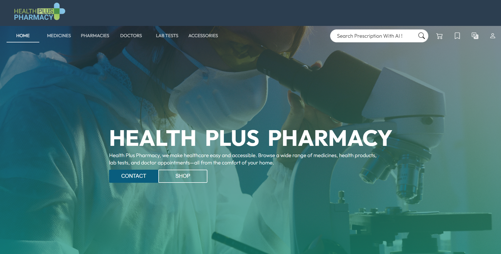
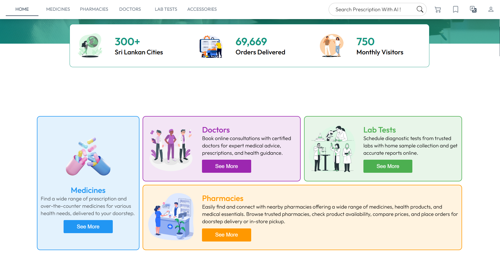
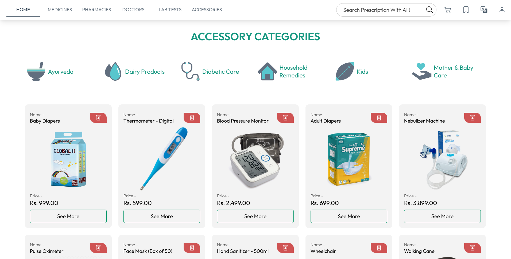
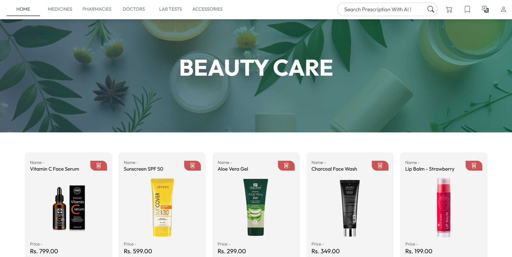
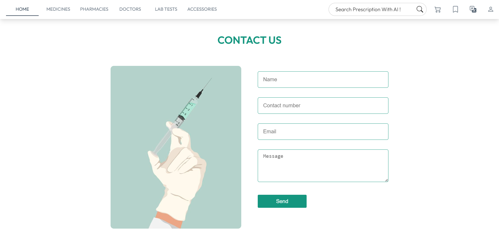
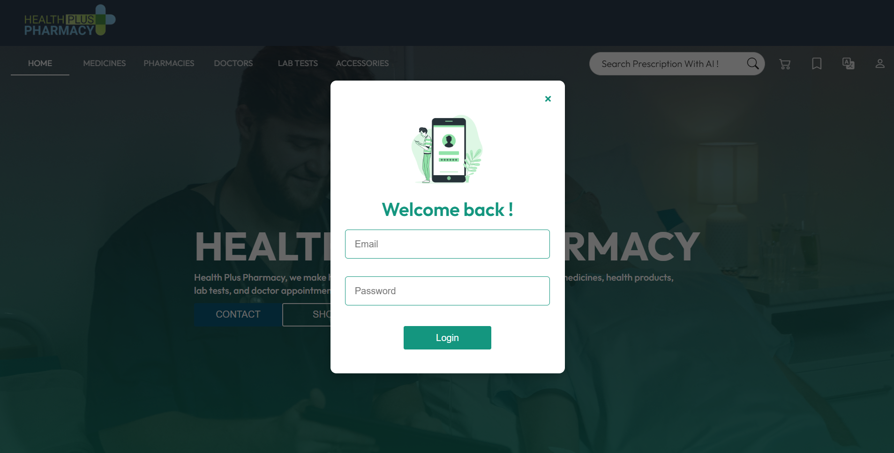
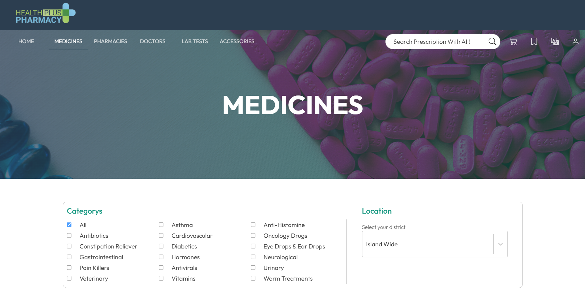
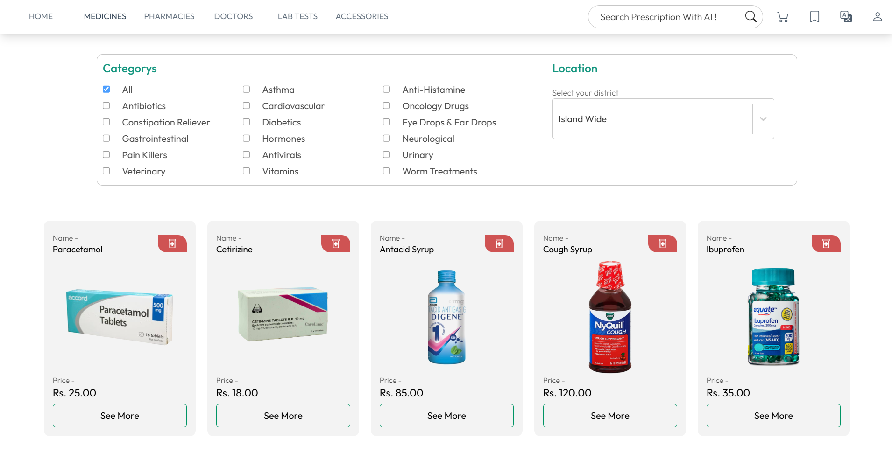

<h2 align="left">E-pharmacy-platform-web-application</h2> 

<h4 align="left">LANGUAGES AND TOOLS :</h4>

 

 

This project is a MERN-based Pharmacy Management Platform designed to connect patients, pharmacists, doctors, and lab providers within a single digital environment.  
The system enables medicine purchasing, prescription handling, order management, and healthcare service integration while ensuring role-based access and security.

<h4 align="left">Key Features :</h4>

<h5 align="left">Customer Features :</h5>
<ul align="left">
  <li>Register/Login to the platform with secure authentication.</li>
  <li>Browse medicines and add them to cart or wishlist.</li>
  <li>Upload prescriptions for verification and order processing.</li>
  <li>Place orders and track order status in real-time.</li>
  <li>Consult with doctors and access lab services.</li>
</ul>

<h5 align="left">Pharmacist Features :</h5>
<ul align="left">
  <li>Register/Login and manage their accounts.</li>
  <li>View uploaded prescriptions and validate them.</li>
  <li>Manage medicine inventory (add, edit, delete products).</li>
  <li>Process orders and update order statuses.</li>
  <li>Communicate with customers regarding prescriptions or orders.</li>
</ul>

<h5 align="left">Doctor Features :</h5>
<ul align="left">
  <li>Register/Login securely.</li>
  <li>Issue channeling dates for patients.</li>
</ul>

<h5 align="left">Lab Owner Features :</h5>
<ul align="left">
  <li>Register/Login to the system.</li>
  <li>Provide diagnostic and testing services.</li>
  <li>Arrange booking dates for lab test.</li>
</ul>

 

This project demonstrates advanced full-stack development skills, including user authentication with JWT, role-based access control, database management with MongoDB Atlas, and a modern React-based frontend. It ensures smooth interaction between multiple stakeholders in the healthcare ecosystem and lays the foundation for a scalable digital pharmacy solution.

 
 
 
 
 
 
 

